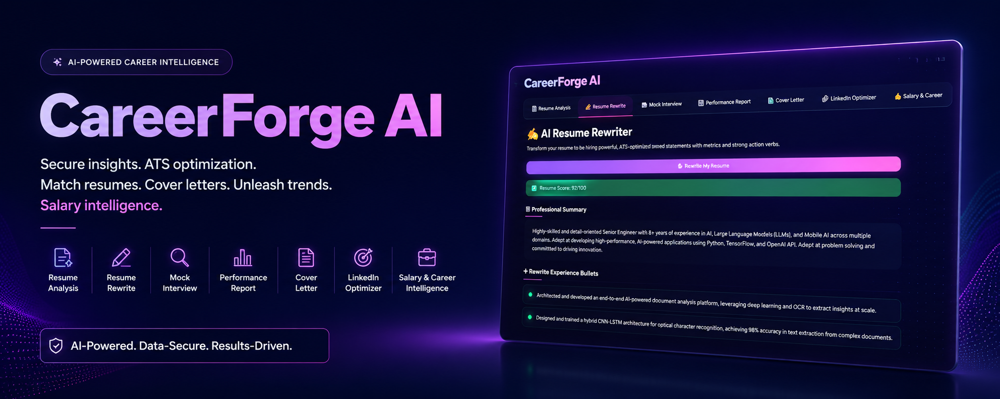
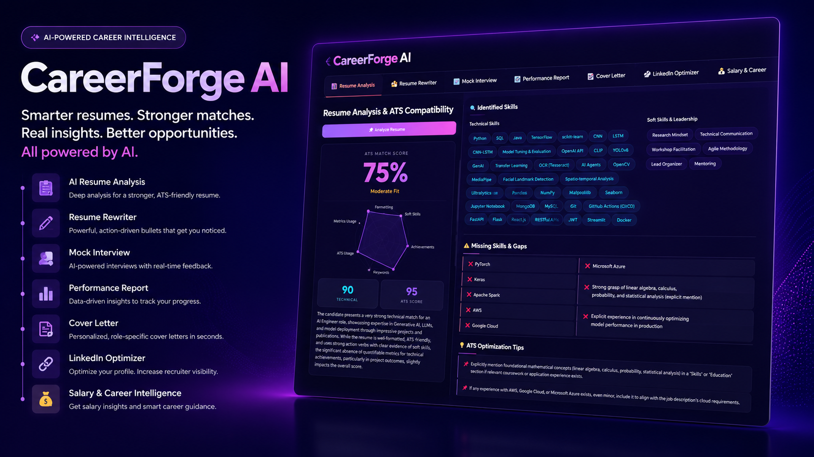

# 🔥 CareerForge AI
<p align="center">
  
</p>
### AI-Powered Resume Intelligence & Career Coaching Platform

CareerForge AI is an advanced AI-powered career intelligence platform designed to help job seekers optimize their resumes, improve ATS compatibility, prepare for interviews, generate professional cover letters, strengthen LinkedIn profiles, and gain valuable salary insights—all within a single premium user experience.

**Analyze Resumes • Optimize ATS Scores • Simulate Interviews • Generate Cover Letters • Enhance LinkedIn Profiles • Get Salary Intelligence**

---

## 🚀 Overview

CareerForge AI goes far beyond traditional resume screening tools. Powered by **Google Gemini**, **LangChain**, and **Pydantic Structured Outputs**, the platform delivers personalized, data-driven career guidance through seven integrated modules.

Whether you're applying for internships, software engineering roles, product management positions, or senior-level opportunities, CareerForge AI helps you present your skills effectively and maximize your chances of success.

### Why CareerForge AI?

* AI-driven resume analysis and ATS optimization
* Intelligent resume rewriting with impact-focused bullet points
* Personalized mock interviews and performance evaluations
* Automated cover letter generation
* LinkedIn profile optimization for recruiter visibility
* Salary insights and career growth recommendations
* Modern enterprise-grade user interface

---

# ✨ Core Features
<p align="center">
  
</p>
## 1. 📊 Resume Analysis & ATS Matching

Evaluate your resume against a target job description using a comprehensive scoring system.

### Key Capabilities

* Multi-dimensional ATS compatibility analysis
* Interactive radar chart visualization
* Technical and soft skill extraction
* Job-description skill gap detection
* ATS optimization recommendations

### Evaluation Metrics

* Technical Match
* Soft Skills
* Formatting
* Action Verbs
* Metrics Usage
* ATS Friendliness

---

## 2. ✍️ AI Resume Rewriter

Transform weak resume bullets into powerful, recruiter-friendly achievements.

### Features

* Action-oriented bullet rewriting
* Quantified achievement generation
* ATS keyword integration
* Professional summary creation
* Improvement tracking
* Downloadable rewritten resume

---

## 3. 💬 Interactive Mock Interview

Practice interviews tailored specifically to your resume and target role.

### Generates

* Technical Questions
* Behavioral Questions
* STAR Method Questions
* Project-Based Questions

### Additional Features

* Real-time conversation interface
* Progress tracking
* Session restart support
* Partial evaluation support

---

## 4. 📈 Interview Performance Report

Receive detailed feedback after every mock interview session.

### Includes

* Overall Interview Score (0–100)
* Strength Analysis
* Improvement Areas
* Question-by-Question Feedback
* STAR-Based Model Answers
* Downloadable Markdown Report

---

## 5. 📝 Cover Letter Generator

Generate professional cover letters tailored to specific roles.

### Available Tones

* Formal & Professional
* Enthusiastic & Energetic
* Concise & Direct

### Output Structure

* Subject Line
* Personalized Opening
* Achievement-Focused Body
* Professional Closing

---

## 6. 🔗 LinkedIn Profile Optimizer

Enhance your LinkedIn profile to improve recruiter visibility.

### Generates

* SEO-Optimized Headline
* Professional About Section
* Skill Recommendations
* Featured Section Suggestions
* Downloadable LinkedIn Content Bundle

---

## 7. 💰 Salary & Career Intelligence

Advanced career guidance powered by AI.

### Salary Insights

* Market Salary Range
* Demand Analysis
* High-Value Skills
* Negotiation Strategies

### Career Roadmap

* Career Growth Strategy
* Recommended Roles
* Skill Development Plan
* Certification Recommendations

### Professional Persona Analysis

* Career Archetype Identification
* Communication Style Assessment
* Personal Branding Suggestions
* Interview Positioning Guidance

---

# 🎨 Design Philosophy

CareerForge AI is built with a strong focus on aesthetics and usability.

### Design Highlights

* **Dark Glassmorphism Interface**

  * Frosted glass cards
  * Blur effects and depth

* **Neon Purple Visual Language**

  * Ambient glows
  * Premium gradients

* **Modern Typography**

  * Inter
  * Outfit
  * JetBrains Mono

* **Micro-Interactions**

  * Smooth hover effects
  * Animated transitions
  * Interactive components

* **Enterprise-Level User Experience**

  * Inspired by Linear, Stripe, and Apple design principles

---

# 🛠 Technology Stack

| Layer                  | Technology                           |
| ---------------------- | ------------------------------------ |
| Frontend               | Streamlit 1.35+                      |
| AI Engine              | Google Gemini 2.5                    |
| Framework              | LangChain                            |
| Structured Output      | Pydantic v2                          |
| Data Visualization     | Plotly                               |
| Resume Parsing         | PyPDF, docx2txt                      |
| Styling                | Custom CSS (Glassmorphism + Neon UI) |
| Environment Management | python-dotenv                        |

---

# 📁 Project Architecture

```text
careerforge-ai/
│
├── app.py
├── requirements.txt
├── README.md
├── .env
├── .env.example
│
├── utils/
│   ├── analyzer.py
│   ├── interview.py
│   ├── parser.py
│   └── rewriter.py
│
├── samples/
│   ├── resume_swe.txt
│   ├── jd_swe.txt
│   ├── resume_pm.txt
│   └── jd_pm.txt
│
└── screenshots/
    ├── 1.png
    └── 2.png
```

---

# 🚀 Getting Started

## Prerequisites

* Python 3.10+
* Google Gemini API Key

## Installation

### 1. Clone the Repository

```bash
git clone https://github.com/yourusername/careerforge-ai.git
cd careerforge-ai
```

### 2. Create a Virtual Environment

```bash
python -m venv venv
```

**Windows**

```bash
venv\Scripts\activate
```

**macOS/Linux**

```bash
source venv/bin/activate
```

### 3. Install Dependencies

```bash
pip install -r requirements.txt
```

### 4. Configure Environment Variables

Create a `.env` file:

```env
GOOGLE_API_KEY=your_api_key_here
```

### 5. Run the Application

```bash
streamlit run app.py
```

Open:

```text
http://localhost:8501
```

---

# 📖 Usage Workflow

### Recommended User Journey

```text
Resume Analysis
        ↓
Resume Rewriter
        ↓
Cover Letter Generator
        ↓
LinkedIn Optimizer
        ↓
Mock Interview
        ↓
Interview Performance Report
        ↓
Salary & Career Intelligence
```

---

# 📦 Sample Data

The project includes sample resumes and job descriptions for quick testing.

| Domain               | Resume         | Job Description |
| -------------------- | -------------- | --------------- |
| Software Engineering | resume_swe.txt | jd_swe.txt      |
| Product Management   | resume_pm.txt  | jd_pm.txt       |

---

# 🤝 Contributing

Contributions are welcome.

1. Fork the repository
2. Create a feature branch

```bash
git checkout -b feature/new-feature
```

3. Commit changes

```bash
git commit -m "Add new feature"
```

4. Push to GitHub

```bash
git push origin feature/new-feature
```

5. Open a Pull Request

---

# 📄 License

This project is released under the MIT License.

See the `LICENSE` file for additional details.

---

<div align="center">

### Built with ❤️ using Google Gemini, LangChain, and Streamlit

**CareerForge AI — Empowering Careers Through Intelligent Automation**

⭐ If you found this project useful, consider starring the repository.

</div>
